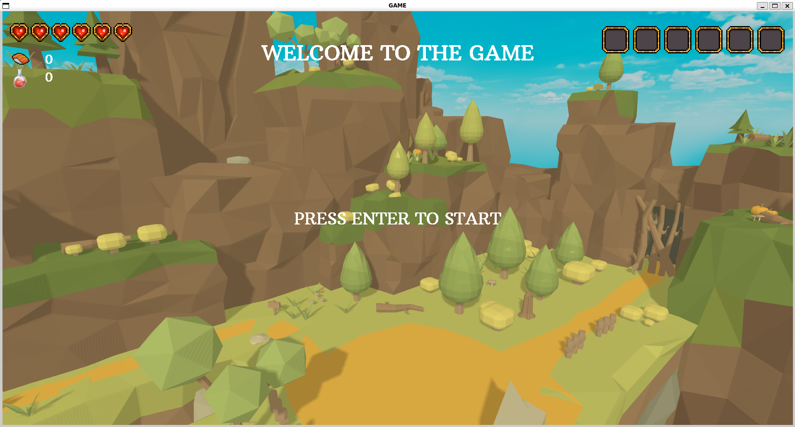
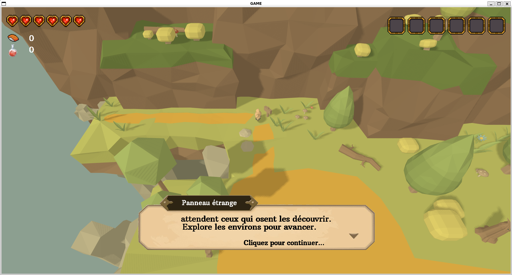
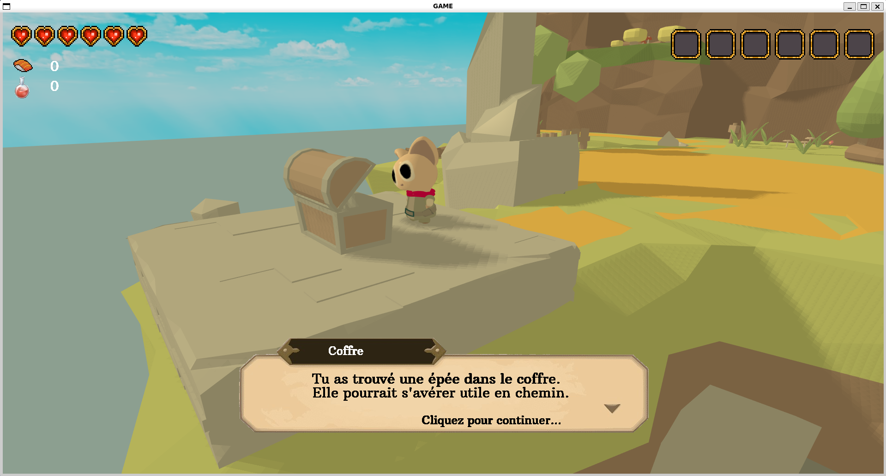
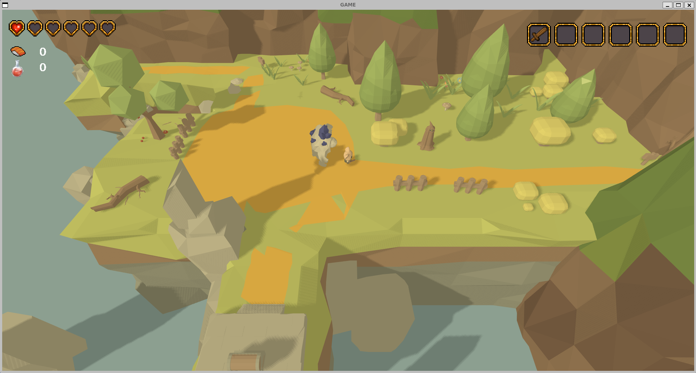
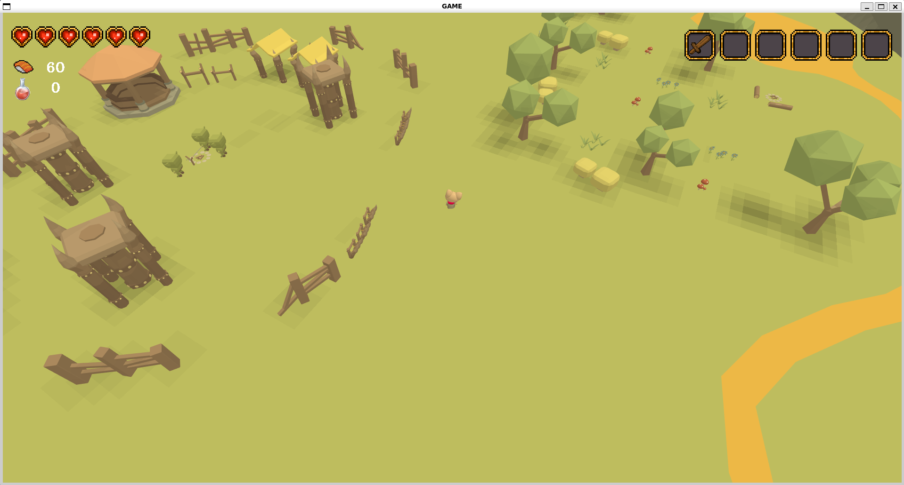
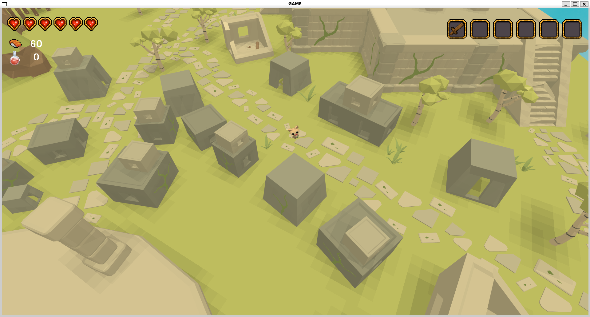

# About the Project 
**[Screenshots at the end](#images).**

### Synopsis :

Embark on an 3D adventure, stranded on the edge of a mysterious island, your goal is to explore its vast landscapes and uncover hidden secrets. To escape, you must find four legendary gems scattered across the island, hidden within unique dungeons guarded by  creatures such as golems, skeletons, and goblins. With simple yet clean graphics **powered by its very own game engine**, the game offers a journey filled with discovery, combat, and adventure.

### Gameplay:

In this expansive open-world adventure, players will explore a mysterious island, uncover its secrets, and solve intricate puzzles. The island is teeming with various monsters, and defeating them allows you to collect valuable loot. Trade this loot with a merchant located at the island's core to upgrade your gear, purchase essential tools for exploring hidden areas, and acquire potions to unlock powerful combat skills. Conquer bandit camps to retrieve hidden treasures, and delve into procedurally generated dungeons, each requiring a key to access the boss room where legendary gems await.

### Features:

- **Open-World Exploration:** Traverse a vast island filled with diverse landscapes and hidden secrets.
- **Monster Encounters:** Battle a variety of monsters and collect loot for trading and upgrades.
- **Merchant System:** Trade collected loot with a central merchant to obtain better equipment, exploration tools, and skill-enhancing potions.
- **Bandit Camps:** Defeat bandits and recover valuable treasures from their camps.
    Procedural Dungeons: Explore unique, procedurally generated dungeons requiring keys to enter the boss rooms.
- **Epic Boss Fights:** Challenge powerful dungeon bosses to retrieve the legendary gems.
- **Skill Unlocking:** Use potions to unlock and enhance combat skills, giving you an edge in battles.
- **Immersive Graphics:** Enjoy simple yet clean and captivating graphics powered by a custom game engine.


### How to play 

- Compile the game (the hardest part)
- ZQSD to move
- Left Click to attack
- E to interact 

### Version :

The game is still in early alpha, wait for future update if you want to play the game

## Dependencies

- C compiler (gcc)
- CMake  (to write makefile faster)
- [SDL2](https://github.com/libsdl-org/SDL)
- [GLAD](https://github.com/premake-libs/glad) (OpenGL API)
- [CGLM](https://github.com/recp/cglm)
- [Assimp](https://github.com/assimp/assimp)


**WARNING** 
It is recommend to update your Version of Opengl to 4.6

On Ubuntu: 

```sh
sudo add-apt-repository ppa:kisak/kisak-mesa -y
sudo apt update && sudo apt upgrade
```
## Build instructions

Only for Debian based/Ubuntu user

**It will ask for sudo password if you have some dependencies to install (don't worry it doesn't install some fancy shit)**

```bash
# Clone this repo
git clone https://github.com/N3ur0sis/pp2i-sdl-game
cd pp2i-sdl-game

#Run scripts, check and install missing deps, build with cmake and run the game
./scripts/run.sh
```

If you have another OS : go on Linux.
## TODO List

- [x] not abandon the project
- [x] remove some memory leaks (just kidding, i'll never do that)
- [x] Basic player movement
- [x] Map creation (Blender) + Level design
- [x] Dungeons procedural Generation
- [x] Lights
- [x] Basic Shadow Mapping
- [x] Import + Render animation
- [x] Basic Combat system
- [x] Menu (Main & Pause )
- [x] GUI
- [x] Inventory system
- [x] Trading System
- [x] Scene Manager
- [x] Entity Component System
- [x] Finish the game
- [x] Find a name for the game

## Images









This project is mainly done for fun and partly done because we have to do it if we want to pass the year.

